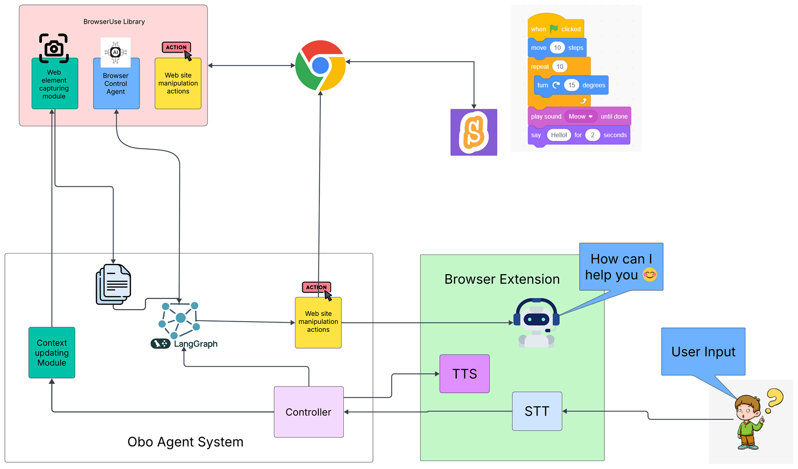
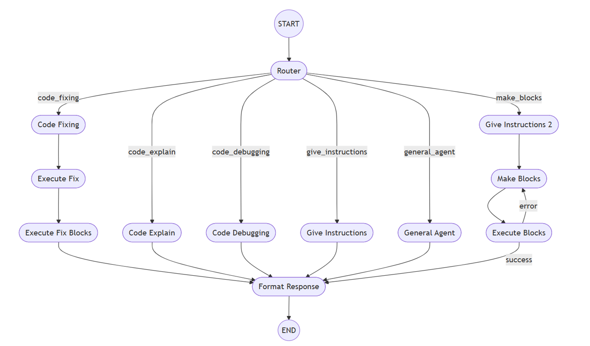

# 🤖 OBO: The AI Coding Companion for Scratch

**OBO** (One Block Over) is an innovative AI assistant designed to **revolutionize children's coding journeys with Scratch**, fostering **independence and creativity**. It provides personalized, real-time support directly within the Scratch environment. Think of OBO as a helpful friend guiding young coders through their adventures.

---

## ✨ Why OBO? The Scratch Challenge

Learning to code in Scratch can be challenging for children, often leading to frustration and disengagement when they get stuck. OBO directly addresses these common problems faced by young coders:

* **Lack of Immediate Support:** Children often struggle to find timely help when confused about a specific block or concept.
* **Difficulty Understanding Code Logic:** Complex scripts can be overwhelming, making it hard to grasp the sequence and purpose of blocks.
* **Unsure How to Use Blocks:** Knowing which blocks to use next is a significant barrier to creativity and project completion.

---

## 💡 Key Features

OBO provides dynamic, on-demand assistance to build understanding and confidence.

### 1. Clarity in Code: Explains Every Block
OBO can **instantly explain the function and purpose of any Scratch code block or sequence**.
* **Example:** If a child asks, *"what move 10 steps is?"*, OBO explains: *"The move block moves a sprite forward by a set number of steps in the current direction..."*.

### 2. Smart Suggestions: Guiding the Next Step
When children are unsure how to achieve a desired outcome, OBO steps in with **intelligent block suggestions**.
* **Example Goal:** *"I want my cat to jump when I press the spacebar."*
* **OBO's Suggestion:** Identifies necessary actions and suggests blocks like **"when space key pressed," "change y by,"** and **"wait"** for a smooth jump.

### 3. The Engaging Avatar: A Visual Guide
More than just text, OBO features an **animated avatar** powered by **Rive**.
* The avatar **moves to the relevant block on the screen** and gives the answer as **voice**.
* This visual cue helps children immediately identify the discussed element, making the learning process **intuitive and engaging**.

---

## 🚀 OBO's Impact on Learning

By providing on-demand assistance and visual guidance, OBO helps transform the learning experience:

* **Boosted Confidence:** Children feel empowered to tackle complex projects.
* **Accelerated Learning:** Concepts are grasped more quickly and effectively.
* **Sustained Engagement:** Children stay motivated and continue their coding journey.
* **Enhanced Creativity:** Less frustration means more focus on innovative ideas.

---

## 🛠️ Technical Foundation

OBO is built on a robust and modern technology stack to ensure a seamless and responsive experience:

| Component | Purpose |
| :--- | :--- |
| **Gemini (LLM)** | The powerful Large Language Model (LLM) that provides intelligent explanations and suggestions. |
| **FastAPI** | Enables fast and efficient communication between the frontend and the AI backend. |
| **Browser-use** | Technology used to precisely identify elements within the Scratch browser. |
| **ElevenLabs** | Used for Text-to-Speech when answering the child's queries. |
| **LangGraph** | Used for build the Agent state graph |

---

## Architecture

## Agent Architecture

## 📺 Learn More: Watch the Demo Video

For a detailed walkthrough and demonstration of OBO in action, check out our YouTube video:

[Watch on YouTube](https://www.youtube.com/watch?v=kLL2LD9P4Xs)

## 🛠️ How to Set Up OBO

### Quick Start (Using Pre-built Package)

1. **Download the Package:**  
    [Download OBO package](https://drive.google.com/file/d/1XmNQntie2juHbZuLwIV61ozyapbu-Q53/view?usp=drive_link)
2. **Run the Application:**  
    Double-click `BrowserUse.exe`.
3. **Configure Paths:**  
    - Enter the path to your Chrome or Edge executable.
    - Enter your Gemini API key.
4. **Start OBO:**  
    Click to launch the application.
5. **Enable Extension in Browser:**  
    - Open your browser’s Extensions page.
    - Enable **Developer mode**.
    - Click **Load unpacked** and select the `Obo Avatar extension` folder.
6. **Refresh Scratch:**  
    Reload the Scratch web page to activate OBO.

---

### Advanced: Run from Source

1. **Set Up Environment:**  
    - Create a virtual environment:  
      `python -m venv venv`
    - Activate it and install dependencies:  
      `pip install -r requirements.txt`
2. **Start Backend Services:**  
    - Run the server:  
      `python ./browseruse/tools/browserUseServer.py`
    - Once the server is running, start the client:  
      `python ./browseruse/tools/browserUseClient.py`
    - Start the agent:  
      `python ./browseruse/Agent/main.py`
3. **Load the Extension:**  
    Follow the steps above to load the extension in your browser.
4. **Refresh Scratch:**  
    Reload the Scratch page to begin using OBO.

---

**Note:**  
- Ensure you have the required permissions to install browser extensions and run executables.
- For any issues, please refer to the project’s documentation or open an issue.
                                                 

## 🤝 Join Us

We are committed to empowering the next generation of innovators, problem-solvers, and digital creators. Join us in shaping a brighter future for educational technology!

